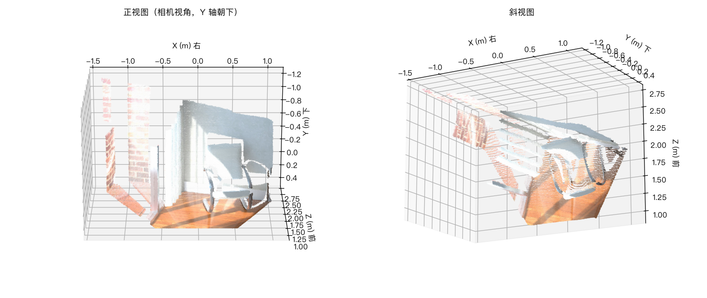

# RGB-D 几何工具箱

一个面向初学者的 RGB-D 几何练习项目：从相机模型出发，自己动手完成深度反投影、
点云生成、刚体变换和一致性检查，最终整理成可运行、可解释的小工具集。

项目的重点不是堆功能，而是把每一步的几何含义讲清楚，并且用测试验证它。
没有 GPU 也能跑，全部基于 CPU 和小规模公开数据。

## 环境

- Python 3.11（conda 环境名 `rgbd`）
- numpy / matplotlib / open3d / pytest

```bash
mamba create -n rgbd -c conda-forge python=3.11 numpy matplotlib -y
conda activate rgbd
pip install -r requirements.txt

# macOS 额外一步：Open3D 依赖系统库 libusb，缺少时 import open3d 会失败
brew install libusb
```

本项目在以下环境实测通过（2026-10-03）：
macOS / Apple M4 / Python 3.11.16 / numpy 2.4.6 / matplotlib 3.11.2 / Open3D 0.20.0。

## 目录结构

```
.
├── README.md
├── pyproject.toml             # ruff 检查与格式化的配置
├── requirements.txt           # 运行依赖
├── requirements-dev.txt       # 开发工具（ruff）
├── notes/
│   ├── learning-log.md        # 学习日志：每步做了什么、验证了什么、还剩什么疑问
│   └── dataset.md             # 数据集说明：来源、内参、格式、已知限制
├── outputs/                   # 效果图等产出
└── work/                      # 练习脚本
    ├── 01_pixel_and_index.py  # 任务 1：像素坐标 (u,v) 与数组下标 [row,col]
    ├── 02_project_points.py   # 任务 2：三维点投影为像素
    ├── 03_backproject.py      # 任务 3：像素加深度反投影为三维点
    ├── 04_inspect_rgbd.py     # 任务 4：真实 RGB-D 数据体检
    └── 05_depth_to_pointcloud.py  # 任务 5：整帧反投影生成点云并对照 Open3D
```

## 运行

```bash
conda activate rgbd
python work/01_pixel_and_index.py
python work/02_project_points.py
python work/03_backproject.py
python work/04_inspect_rgbd.py     # 需要先按 notes/dataset.md 下载数据
python work/05_depth_to_pointcloud.py
```

点在云文件体积较大，已在 .gitignore 中排除 outputs/*.ply，需要时用上面的脚本重新生成。

## 代码规范

代码检查与格式化统一交给 ruff，配置在 pyproject.toml：

```bash
conda activate rgbd
ruff check .            # 检查代码问题
ruff format --check .   # 只检查格式，不改文件
ruff format .           # 按规范重排格式
```

VS Code 已安装 ruff 扩展，会读取同一份 pyproject.toml，编辑时即时提示。

注释约定：docstring 采用 NumPy 风格（Parameters / Returns / Notes 三节），
行内注释只写「为什么这么写」，不写「这段代码在做什么」。
pyproject.toml 中有意停用了三条规则（D400、N803、N806），理由写在该文件的注释里。

## 进度

- [x] 阶段 0：环境搭建与检查
- [x] 阶段 1：相机模型（任务 1 像素坐标与数组下标、任务 2 投影、任务 3 反投影与往返一致性）
- [x] 阶段 2：读取并检查真实 RGB-D 数据，见 notes/dataset.md
- [x] 阶段 3：自己实现深度反投影生成点云，与 Open3D 对照误差 1.2e-07 m
- [ ] 阶段 4：坐标变换与一致性测试
- [ ] 阶段 5：点云过滤与项目整理

## 效果

第 0 帧反投影得到的点云（267129 个点，颜色取自彩色图）：



## 目前的核心结论

- 图像数组的第 0 轴是竖直方向（v），第 1 轴是水平方向（u），
  所以「像素坐标 (u, v)」翻译成数组下标要写成 `[v, u]`。
- 相机坐标系（OpenCV/Open3D 约定）：X 右、Y 下、Z 沿光轴向前。
- 程序不报错不等于结果正确，行列互换、RGB/BGR、深度单位、内参分辨率不匹配
  都属于「能跑完但算错」，必须靠主动设计的检查发现。
- 深度图的 0 不是「距离 0」，而是无效标记。统计数据前必须先区分有效像素。
- 数据能验证的写实测值，数据无法验证的（例如深度是沿光轴的 Z）写依据来源，
  两类结论不能混在一起。
